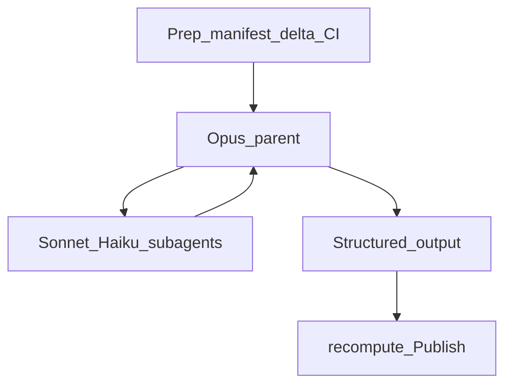

# `ai-review` OSH + delta + Test-Plan/CI — design

**Status:** Slices 1–3 landed on branch `feat/ai-review-osh-delta-testplan` (delta, Test Plan ↔ CI, OSH fan-out); consumer docs + ADR 0006 record the checklist-tick retirement.
**Extends:** [`2026-08-07-ai-review-parallel-review-design.md`](./2026-08-07-ai-review-parallel-review-design.md)
(parallel OSH / coverage–coherence / rubric scoring). This document does **not** supersede that
design’s §1 binding constraints or its scoring/`recompute.js` contract.
**Authors:** synthesized from a live design session with the repo owner (2026-08-17), freezing the
locked product decisions below.

---

## 1. Purpose

Three changes land as one end-state for `ai-review`:

1. **Delta reviews** — on re-runs, review only commits after the last published `<!-- ai-review -->`,
   not the full merge-base…HEAD range every time.
2. **Test Plan ↔ CI** — map PR Test Plan / checklist items to CI coverage; gaps become normal findings
   (P0–P3). Stop ticking checklist boxes in the PR body.
3. **OSH fan-out** — Opus parent manages native Sonnet workers and Haiku helpers inside one
   `claude-code-action` invocation, collapsing to a single reviewer when the roster says `K=1`.

Together they cut cost and wall-clock on `synchronize` / re-runs, make Test Plan signal honest (CI
coverage, not “verified” ticks), and deliver the parallel OSH orchestration the 2026-08-07 design
already specified — without replacing how findings are scored or gated.

---

## 2. Relationship to the parallel OSH design (2026-08-07)

The 2026-08-07 document remains the source of truth for:

- Binding constraints (§1): **rubric scoring stays**; **must read all** for the active review range.
- Coverage / coherence / intent / history roles, `K = clamp(ceil(bytes / BUDGET), 1, 4)`, cluster
  packing, independent Haiku scoring, deterministic aggregation.
- Fail-closed matrix and frozen artifact shapes (`assignments.json`, per-role findings, gate input).
- No Node `Promise.race` orchestrator — concurrency is Claude Code’s subagent scheduler inside one
  process.

This 2026-08-17 document **adds**:

- A durable **delta baseline** (HTML meta on the published review) and invalidate → full rules.
- **Test Plan vs CI** finding semantics and retirement of checklist tick write-back.
- An explicit **ship order** that lands delta and Test-Plan/CI *before* OSH fan-out, because gateway
  stall risk (#43 / ADR 0005) multiplies with concurrent subagent surface.

Where the two conflict on product intent, treat this document as the later refinement for delta,
Test-Plan/CI, and orchestration *delivery*; treat 2026-08-07 as authoritative for scoring vocabulary,
must-read-all, roster math, and aggregation. **Exception (K=1 collapse):** §5.2 of this document
overrides parallel design §5’s minimum roster `{R1,H}` — the collapse path is a single Sonnet session
with no Opus parent and no independent Haiku scorer (see §5.2).

---

## 3. Locked product decisions

| Decision | Choice |
|---|---|
| Orchestration | Opus parent + native Sonnet/Haiku subagents in one `claude-code-action` invocation |
| Delta baseline | Commits after last published `<!-- ai-review -->` with meta `head_sha` |
| Full review when | First run, missing meta, inconclusive prior, force-push/non-ancestor, base change, `force-full-review` |
| Test plan | Map to CI; gaps → findings P0–P3; stop ticking checklist boxes in PR body |
| Ship order | Slice 1 delta → Slice 2 test-plan/CI → Slice 3 OSH fan-out |

Rejected alternatives (recorded so they are not re-opened casually):

- Separate composite stages per worker / Opus-only judge stage (orchestration option B).
- Always re-run a full-PR intent+cross-file pass on every delta (delta option B).
- Delta = `github.event.before…after` only (weaker on rebase / manual re-runs).
- Floor uncovered Test Plan items at P1 or auto-classify regression gaps as P0 (severity stays
  model-judged via the rubric, then `recompute.js`).

---

## 4. Binding constraints carried forward

From parallel design §1 — still non-negotiable:

- **Rubric scoring stays.** P0–P3 severity vocabulary, confidence formula, and `recompute.js` input
  contract are unchanged. What changes is *how findings are produced* (OSH roles, Test Plan gaps as
  findings, delta range), never how they are scored or gated. P2/P3 never block; gate uses
  `gateConfidence` (ADR 0004).
- **Must read all (active range).** Full contents of every file in the **active review range**,
  always. No sampling, no truncation, no diff-hunk-only reasoning. In full mode the active range is
  every file changed merge-base…HEAD. In delta mode it is every file touched in
  `prior_head…HEAD`. Neighbor files outside the delta may be read when prior findings or imports
  require it (prompt rule); that is targeted expansion, not a silent downgrade of must-read-all on
  the active set.

Additional constraints that remain binding for this work:

- No test runners / package managers in the allowlist (ADR 0004 / README). `test_execution` stays
  `"skipped"`.
- Fail closed on missing structured output.
- Schema stages: Claude primary → structured-output-capable free fallbacks only (no Cursor on
  `--json-schema` stages). Context (non-schema) may still use the Claude → Cursor → free cascade.
- Injection safety: attacker-controlled content via files / `env:`, never `${{ }}` interpolation into
  `run:` / `script:` bodies (ADR 0001).
- Never untick human checklist boxes; under this design, **stop ticking** verified boxes entirely.

---

## 5. OSH roles (orchestration)



### 5.1 Role map

| Tier | Who | Mandate |
|---|---|---|
| **O**pus (parent) | One `claude-code-action` session with `--model` Opus when fan-out is live | Intent isolation ownership (or dispatch of the intent role), prioritization, conflict resolution across worker outputs, final structured judgment (`comment_markdown` + schema fields). Does **not** exhaustively re-read every file on large diffs when workers already covered them. |
| **S**onnet (workers) | Coverage cluster reviewers R1..Rk from `roster.js` / `assignments.json`; tracer / coherence as in 2026-08-07 §4 | Full-file reads of assigned paths; propose findings with severity. |
| **H**aiku (helpers) | History / mechanical gathers + **independent confidence scoring** | Cheap collection and scoring that must not be the same model that found the issue (parallel design §3). |

Only the **Opus parent** emits `--json-schema` structured output for Publish. Workers return freeform
or JSON **via Task results** (no unscopeable Write on the review allowlist); the parent aggregates into
the schema contract. Aggregation
(`lib/aggregate.js` when landed) and `recompute.js` remain deterministic consumers — model-reported
counts are never trusted as gate inputs.

### 5.2 Collapse when K=1

`K` is still the read-budget from parallel design §5:

```
K = clamp(ceil(total_fullfile_bytes / BUDGET), 1, 4)
```

Cap remains **K≤4**. Fan-out is an option when the work exceeds one reviewer’s comprehension budget,
not a fixed pipeline every PR pays for.

**Collapse rule (this design — overrides parallel design §5 minimum `{R1,H}`):**

- If the roster / `assignments.json` implies **K=1** (single coverage reviewer holds the whole
  active-range byte budget): run a **single Sonnet** review session that emits `--json-schema`
  structured output directly — **no Opus parent**, **no independent Haiku scorer**. Artifact
  contracts may match today’s single-session shape (not full findings/scores fan-in). Fail-closed
  path unchanged; lower cost.
- If **K>1**: Opus parent + native Sonnet/Haiku subagents consuming `assignments.json`. Independent
  Haiku scoring applies only on this path (finder ≠ scorer), per parallel design §3 / §7b.

Prep always emits the manifest and roster. For **K>1**, topology still collapses by roster size
inside the Opus parent; for **K=1**, the topology is the collapsed single-session path above (not
the parallel design’s `{R1,H}` minimum). Diff-size Sonnet-vs-Opus routing thresholds
(`sonnet-files-threshold` / `sonnet-churn-threshold`) are deprecated once Slice 3 is live; they may
remain accepted for backward compatibility until removed in a follow-up.

### 5.3 What this deliberately is not

There is **no** separate Node orchestrator, no per-worker composite stage matrix, and no
`Promise.race` around SDK subprocesses. Concurrency is Claude Code’s own subagent scheduler inside
one process; wall-clock is bounded by the caller’s job `timeout-minutes`.

---

## 6. Delta baseline and invalidate rules

### 6.1 Meta marker (exact format)

Published review bodies carry a machine-readable baseline immediately after `<!-- ai-review -->`:

```html
<!-- ai-review-meta head_sha=abc base_sha=def mode=full|delta -->
```

- `head_sha` — the PR HEAD that was reviewed.
- `base_sha` — the merge-base (or documented review base) at publish time.
- `mode` — `full` or `delta` for successful structured reviews.

For **inconclusive** publishes: omit `mode` or set `mode=inconclusive` so the next run cannot treat
that body as a valid delta baseline (forces full).

Banner / strip logic that already removes `<!-- ai-review -->` for display must continue to strip the
meta line cleanly.

### 6.2 Resolving the baseline

On each run, Prep (or a dedicated step after identity):

1. List PR reviews from the bot.
2. Find the latest body containing `<!-- ai-review -->` with parseable meta and a usable `head_sha`.
3. Decide `mode: full | delta` and write `.ai-review/delta.json` (plus optional
   `.ai-review/prior-review.md` for carry-forward).

**Delta mode** when a valid prior exists: review range is `prior_head_sha…current_head_sha` (commits
and files after the last published review). The review prompt must read prior findings and mark
resolved vs still-open.

**Full mode** when any of the following hold:

| Trigger | Why |
|---|---|
| First run on the PR (no prior `<!-- ai-review -->`) | No baseline |
| Missing or unparseable meta | Cannot trust prior HEAD |
| Prior review inconclusive (`mode` absent / `inconclusive`) | Prior judgment incomplete |
| Force-push / prior `head_sha` not an ancestor of current HEAD | History rewritten |
| Base branch SHA change (current merge-base SHA ≠ meta `base_sha`) | Diff identity changed |
| Input `force-full-review: true` | Operator override |

Manifest fields (additive; keep existing `base_sha` / `head_sha` as PR merge-base and HEAD for
telemetry):

- `review_mode`: `full` \| `delta`
- `delta_base_sha`: nullable (prior head when delta)
- `prior_head_sha`: nullable

### 6.3 Must-read-all under delta

“Must read all” applies to **files in the active range**. Cross-file risks that span outside the
delta: the Opus parent (or Sonnet worker under parent direction) must pull neighbor files when prior
findings or imports require it. Default behavior is not a second full-PR exhaustive read.

---

## 7. Test Plan ↔ CI finding rules

### 7.1 Intent

The review does **not** execute the Test Plan and does **not** mark checklist items verified in the
PR body. CI is the source of truth for “was this exercised?”; uncovered Test Plan intent becomes a
**finding**, not a tick.

### 7.2 Prep artifacts

- Parse PR body Test Plan section and/or checklist items → `.ai-review/test-plan-items.json`.
- Inventory workflow jobs / check runs for the PR (all PR events, not only `workflow_dispatch`) →
  `.ai-review/ci-checks.json`.
- Mapping quality may be model-assisted in the review prompt; pure helpers extract and summarize.

### 7.3 Finding contract

- Each Test Plan / checklist item that is **not** covered (or only weakly covered) by CI becomes a
  normal `findings[]` entry with severity **P0–P3** judged via the existing rubric.
- Gate rules unchanged: P0/P1 can fail; P2/P3 never block; `recompute.js` unchanged.
- Do **not** populate checklist-for-ticking fields for Publish write-back (schema field may remain an
  empty array).

### 7.4 Stop ticking

- Disable / remove Publish paths that call `tickVerifiedBoxes` or status-block checklist write-back
  for verified items (`update-pr-body` checklist behavior off for this path).
- Linked-issue updates that are independent of checklist ticks may remain if unchanged by this work.
- Never untick boxes humans already checked.

### 7.5 Constants that stay

- `test_execution: skipped`, no runner allowlist, no package-manager execution from PR-head content.

---

## 8. Ship order

Implement as three sequential slices. Do not start Slice 3 until Slice 1 and Slice 2 are landed and
stable enough that fan-out is not the first multiplier on an unfinished baseline/Test-Plan path.

| Slice | Deliverable | Why this order |
|---|---|---|
| **1 — Delta** | Meta marker, baseline resolver, manifest/prompt range wiring, `force-full-review` | Immediate token and wall-clock win on re-runs; works with today’s serial review |
| **2 — Test-Plan/CI** | CI inventory + items artifacts; findings for gaps; stop checklist ticks | Honest Test Plan signal without waiting on OSH |
| **3 — OSH fan-out** | Opus parent + Sonnet/Haiku subagents from roster; K=1 collapse; deprecate size-based model routing | Largest stall-surface change; ship after cheaper slices reduce how often / how large full reviews are |

Follow-up docs (README / plan / short ADR note that checklist tick write-back is retired) land after
the slices or alongside Slice 2–3 as consumer-facing copy catches up.

---

## 9. Non-goals

- **No test execution** in the review stage (already removed; this design does not restore it).
- **No separate stage orchestrator** (rejected option B): no matrix of worker jobs and no Node
  Promise.race wrapper around the SDK.
- **No fix for gateway stall #43 / ADR 0005** in this workstream — fan-out multiplies surface; keep
  `K≤4` and ship delta + Test-Plan/CI first.
- **No ai-qa redesign** unless a follow-up explicitly opens it.
- **No rewriting** of historical dismissed review bodies on GitHub to backfill meta.
- **No replacement** of `recompute.js` or the fail-closed Publish contract.

---

## 10. Frozen interfaces (additive)

These names are frozen for implementation parcels; details may deepen in code but the contracts
below must not silently change meaning.

**`.ai-review/delta.json`** (Slice 1) — example shape:

```json
{
  "schema": 1,
  "mode": "delta",
  "reason": "prior-meta-ancestor",
  "delta_base_sha": "abc…",
  "prior_head_sha": "abc…",
  "head_sha": "def…",
  "merge_base_sha": "…",
  "prior_body_path": ".ai-review/prior-review.md"
}
```

**Meta helpers** (Slice 1):

- `parseReviewMeta(body) → { headSha, baseSha, mode } | null`
- `formatReviewMeta({ headSha, baseSha, mode }) → '<!-- ai-review-meta … -->'`
- `resolveDeltaBaseline({ reviews, headSha, mergeBaseSha, forceFull }) → { mode, deltaBaseSha, priorHeadSha, priorBody, reason }`

**Test-Plan/CI helpers** (Slice 2):

- `extractTestPlanItems(prBody) → string[]`
- `summarizeCiChecks(checkRuns) → { name, conclusion, status }[]`

**Roster / assignments** (Slice 3) — continue to follow 2026-08-07 §6; parent prompt consumes
`assignments.json` and must not invent a second partition scheme.

---

## 11. Risk notes (design-level)

| Risk | Mitigation |
|---|---|
| Delta under-reads cross-file breakage | Prompt rule: expand to neighbors when prior findings / imports require; invalidate → full on rebase/base change |
| Fan-out × gateway stall (#43) | Ship order Slice 1→2→3; K≤4; single parent SO |
| Resume / missing `session_id` on SO failure | Keep repair recovery + fail-closed + retry budget (already in cascade work) |
| Checklist semantics confusion | Docs: ticks retired; findings carry uncovered Test Plan signal |
| Subagents emit schema | Forbidden — only Opus parent (or collapsed single Sonnet session) owns `--json-schema` |

---

## 12. Self-consistency checklist

This design is complete when:

- Locked decisions in §3 match the owner-approved brainstorm (2026-08-17).
- Parallel design §1 constraints (rubric scoring; must-read-all for the active range) are affirmed,
  not weakened.
- Meta format is exactly the HTML comment in §6.1.
- Non-goals explicitly exclude test execution, separate stage orchestrators, and fixing #43 here.
- Ship order is Slice 1 delta → Slice 2 test-plan/CI → Slice 3 OSH, with K≤4 collapse at K=1.
- `recompute.js`, fail-closed Publish, and SO-free cascade for schema stages remain in force.

---

## Appendix A — Opus parent prompt contract (Slice 3)

Frozen for the live `claude-code-action` parent session when fan-out is active.
Prep still emits `.ai-review/assignments.json`; the parent **must** consume that roster
and must not invent a second partition.

### Locked model IDs (action-level; keep in sync with `ai-review` / `ai-qa`)

| Tier | Primary ID used in action / roster |
|---|---|
| Opus (parent / intent tier) | `claude/claude-opus-5` |
| Sonnet (coverage + tracer + Task helpers) | `claude/claude-sonnet-5` |
| Haiku (context stage only — top-level session) | `claude/claude-haiku-4-5-20251001` |

**Task subagents must not use Haiku under an Opus parent.** Claude Code Task
subagents inherit the parent's adaptive/extended thinking; Haiku returns
`400 adaptive thinking is not supported on this model` on this gateway.
History + independent scorer therefore run as **Sonnet** Task agents
(`osh-history`, `osh-scorer` via `--agents`); finder ≠ scorer still holds
because they are separate sessions. Context-stage Haiku remains valid (not a
Task child of Opus).

Subagents use pre-registered `--agents` (`osh-coverage`, `osh-tracer`,
`osh-history`, `osh-scorer`) plus `assignments.json` role partition. Cap remains
**K ≤ 4** coverage reviewers (`roster.js` `MAX_K`).

### Fan-out path (`assignments.json` `.k` > 1)

1. Parent session `--model` is Opus. Only this session may use `--json-schema` / emit
   structured output for Publish.
2. Read `.ai-review/assignments.json`. Spawn native Claude Code **Task** subagents
   in **one parallel wave** using `--agents`:
   - **`osh-coverage`** (Sonnet) — one Task per `reviewer-*`.
   - **`osh-tracer`** (Sonnet) — coherence.
   - **`osh-history`** (Sonnet) — perspective gathers.
   - **`osh-scorer`** (Sonnet) — independent confidence / `severity_confirmed`.
   - **Intent** (`kind: frame`): Opus owns it (parent may run it itself or dispatch an Opus-tier
     subagent). Keep intent isolated from coverage analysis.
3. Workers return freeform or JSON **via Task tool results** (Review allowlist
   has Task on fanout only — **no Write**; Claude Code cannot scope Write to
   `.ai-review/`). They must **not** emit the Publish `--json-schema` blob.
4. Opus **must not** exhaustively re-read every file workers already covered unless conflict
   resolution or a spot-check needs it. Must-read-all for the active range is satisfied by the
   coverage workers' union of `assigned_files` (plus tracer / neighbor expansion rules).
5. Parent aggregates worker outputs into the schema contract (`comment_markdown`, `findings`,
   `counts`, `intent`, etc.). On fan-out, each finding's `confidence` /
   `severity_confirmed` must come from **`osh-scorer`** (finder ≠ scorer) —
   the parent must not self-score when a scorer ran. Publish continues to consume
   **parent structured output** (same fail-closed gate as today); multi-file
   `aggregate.js` remains shadow/non-gating until a follow-up wires it live.

### Collapse path (`assignments.json` `.k` ≤ 1, including empty-diff `k: 0`)

- Single **Sonnet** session with `--json-schema` — **no** Opus parent, **no** independent Haiku
  scorer, **no** subagent fan-out instructions.
- Artifact / SO shape may match today's serial review. Fail-closed path unchanged.

### Routing note

Once Slice 3 is live, model selection is **roster K**, not `sonnet-files-threshold` /
`sonnet-churn-threshold`. Those inputs remain accepted for backward compatibility but do not
choose the review model.
