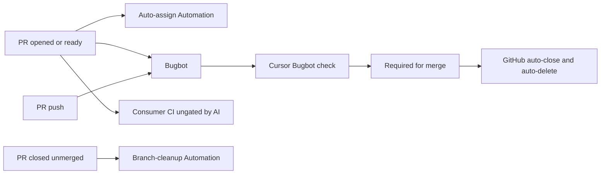

# Retire github-actions → Bugbot + Cursor Automations — Design

**Status:** Approved  
**Date:** 2026-09-14  
**Repo:** EdulyCom/github-actions

## Goal

Fully retire `EdulyCom/github-actions` and remove all callers, preserving consumer intent via Cursor Bugbot, two shared Cursor Automations, and native GitHub settings.

## Locked decisions

- **Gate model A:** merge-only Bugbot check; consumer CI no longer `needs:` an AI job (compute conservation dropped)
- **Review:** Bugbot (not custom high-fidelity Automations review; not OSH/delta/rubric port)
- **Delivery:** no health-URL polling; no premature issue reopen; no `✓/✗ /ai-qa` labels
- **Hygiene:** GitHub auto-close linked issues + auto-delete head on merge; Automation only for **close-without-merge** branch delete
- **Auto-assign:** one shared Cursor Automation for all consumers
- **Approach:** multi-repo scoped Automations (not per-repo copies)

## Consumers

| Repo | Legacy callers |
|------|----------------|
| EdulyCom/eduly | `ci.yml` ai-review + auto-assign + review-gate; `ai-qa.yml` |
| EdulyCom/ezzu | same |
| EdulyCom/infra-template | ai-review + auto-assign + review-gate |
| EdulyCom/infra-payload | ai-review + auto-assign (in-job verdict) |
| Lagn-App/lagn | ai-review + auto-assign (`AI_REVIEW_REQUIRED`) |
| aikstudio/aik | ai-review + auto-assign |

## Replacement map

| Old | New |
|-----|-----|
| `ai-review` + `review-gate` | Bugbot + required **Cursor Bugbot** check |
| `auto-assign` | Shared Automation: PR opened/ready → assign author |
| `ai-qa` | Native auto-close + auto-delete; Automation: unmerged close → delete head |
| This repo | Archive after zero callers |

## Architecture

## Automations

### Auto-assign PR author

- Trigger: PR opened + ready for review
- Scope: all six consumer repos
- Behavior: if author login does not end with `[bot]` and assignees empty → assign author; else no-op

### Delete head branch on close-without-merge

- Trigger: PR closed
- Guard: only when not merged
- Behavior: delete head ref if same-repo, not default branch, and no other open PR uses that ref; on 403/failure, stop cleanly
- Non-goals: merged PRs, forks, issue reopen, labels, health

## Consumer cutover

1. Enable Bugbot; add required check; enable fail-on-unresolved where available
2. Prove on a real PR
3. Strip Actions callers and `needs:` edges; delete `ai-qa.yml` where present
4. Enable GitHub auto-close + auto-delete head branches
5. Remove obsolete required check names only after Bugbot is proven

Rollout order: infra-template → infra-payload → aik → lagn → ezzu → eduly

## Retirement

After zero callers and soak: archive `EdulyCom/github-actions` with a README banner pointing at Bugbot + Automations. Audit Anthropic secrets before deletion.

## Out of scope

- Custom rubric / OSH / delta review port
- Health polling or agentic post-merge QA
- Thin GHA pollers for compute conservation
- Hard-delete of this repo (archive only unless later requested)
